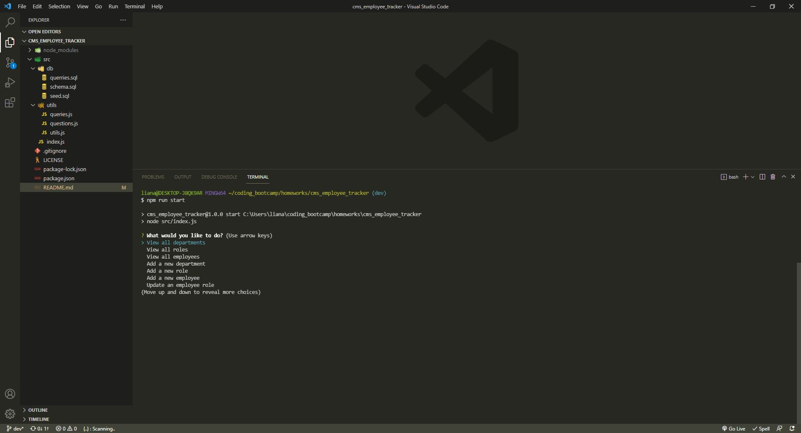
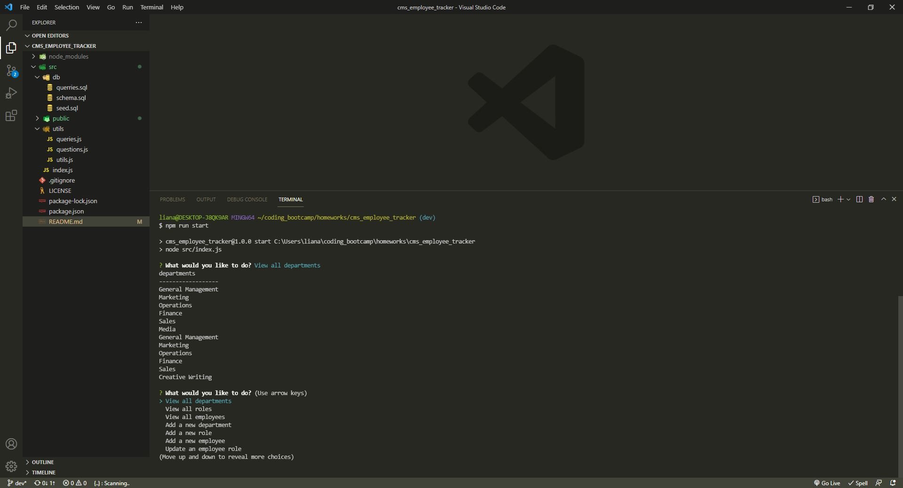
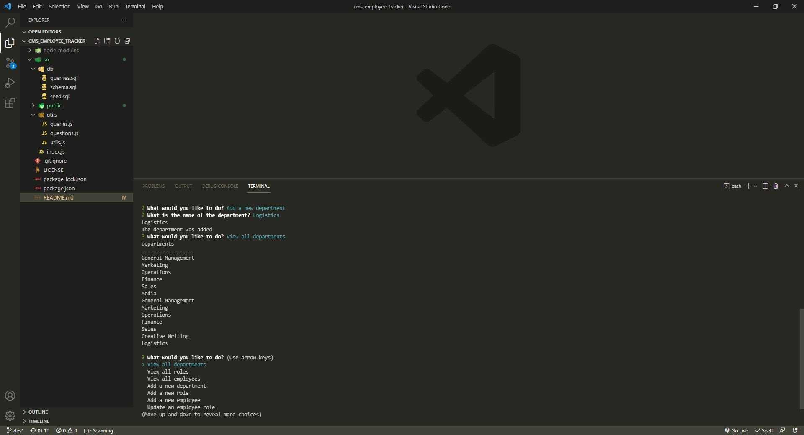

# cms_employee_tracker

A command line app that manages a company's employee database, using Node.js, Inquirer, and MySQL.

## Table of Contents

- [cms_employee_tracker](#cms_employee_tracker)
  - [Table of Contents](#table-of-contents)
  - [Description](#description)
  - [Link to Demo Video](#link-to-demo-video)
  - [User Story](#user-story)
  - [Packages Used](#packages-used)
  - [Technical steps](#technical-steps)
  - [Getting Started](#getting-started)
    - [Installation](#installation)
      - [Clone repository](#clone-repository)
      - [Install packages](#install-packages)
    - [Usage](#usage)
  - [Questions](#questions)
  - [Screenshots](#screenshots)
    - [Start app options](#start-app-options)
    - [View all departments command](#view-all-departments-command)
    - [Add departments questions and command](#add-departments-questions-and-command)

## Description

A **content management systems (CMS)** application that allows business individuals to interact with information about their company, stored in a SQL database. The user is able to interact with the app from the terminal, using Inquirer to choose different options as `view all departments`, `add role` or `update employee role`. When the user clicks on one of the options, a promise request is made to access the database and execute the command e.g. `view`, `add` or `update` in the company database. When the promise is executed, the user is prompted with a `console table` presenting the information requested or a success message that information has been updated in the database.

## Link to Demo Video

Click [here](https://drive.google.com/file/d/1_x26K5AT7mpZqX34nhWSp_-yjTPJMaMo/view) to watch the app demo.

## User Story

```md
AS A business owner
I WANT to be able to view and manage the departments, roles, and employees in my company
SO THAT I can organize and plan my business
```

```md
WHEN I start the application
THEN I am presented with the following options: view all departments, view all roles, view all employees, add a department, add a role, add an employee, and update an employee role
WHEN I choose to view all departments
THEN I am presented with a formatted table showing department names and department ids
WHEN I choose to view all roles
THEN I am presented with the job title, role id, the department that role belongs to, and the salary for that role
WHEN I choose to view all employees
THEN I am presented with a formatted table showing employee data, including employee ids, first names, last names, job titles, departments, salaries, and managers that the employees report to
WHEN I choose to add a department
THEN I am prompted to enter the name of the department and that department is added to the database
WHEN I choose to add a role
THEN I am prompted to enter the name, salary, and department for the role and that role is added to the database
WHEN I choose to add an employee
THEN I am prompted to enter the employee’s first name, last name, role, and manager, and that employee is added to the database
WHEN I choose to update an employee role
THEN I am prompted to select an employee to update and their new role and this information is updated in the database
```

## Packages Used

- Node.Js
- Inquirer
- MySQL

## Technical steps

- used Inquirer.js to prompt user with questions regarding database manipulation e.g. `view all employees, update role, add role, view department`

- used mySQL shell to manipulate data

## Getting Started

### Installation

To run the application, you will need to have [node.js](https://nodejs.org/en/) installed.

#### Clone repository

`git clone git@github.com:lianavaleria15/cms_employee_tracker.git`

#### Install packages

- use `npm init -y` to install package.json

### Usage

- run `npm run start` in the terminal to connect to the server

## Questions

If you have any questions related to the application or repository, would like to collaborate or open an issue, please use the contact details below:

- 👩 [Liana Laurentiu](https://github.com/lianavaleria15)
- 📧 [liana.valeria15@gmail.com](mailto:liana.valeria15@gmail.com)

## Screenshots

### Start app options



### View all departments command



### Add departments questions and command


